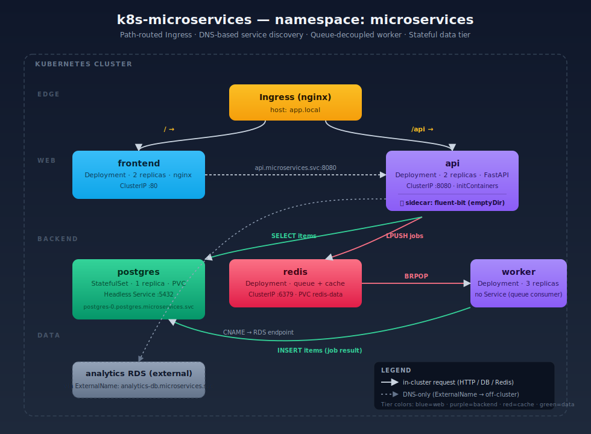

# k8s-microservices

A multi-service application running on Kubernetes that demonstrates service discovery, stateful workloads, sidecars, network segmentation, and queue-based decoupling. Four workloads — `frontend`, `api`, `worker`, and `postgres`/`redis` — share a single namespace and communicate exclusively through cluster DNS.

## Architecture

<p align="center">
  
</p>

### Request flow

1. Browser hits `http://app.local/` → Ingress → `frontend` Service → nginx serves `index.html`.
2. JS calls `POST /api/jobs` → Ingress (`/api` rewrite) → `api` Service → FastAPI pushes JSON onto Redis list `jobs`.
3. A `worker` pod blocks on `BRPOP jobs`, parses the payload, and writes a row to Postgres.
4. Browser polls `GET /api/items` → API reads recent rows from Postgres and returns JSON.

## Components

| Component | Kind                    | Replicas | Purpose                                              | Image                         |
|-----------|-------------------------|----------|------------------------------------------------------|-------------------------------|
| frontend  | Deployment + ClusterIP  | 2        | Static UI (nginx) on port 80                         | `frontend:latest`             |
| api       | Deployment + ClusterIP  | 2        | FastAPI on 8080 with Fluent Bit sidecar              | `api:latest`                  |
| worker    | Deployment (no Service) | 3        | Consumes Redis queue, writes Postgres rows           | `worker:latest`               |
| redis     | Deployment + ClusterIP  | 1        | Job queue, persistent via standalone PVC             | `redis:7-alpine`              |
| postgres  | StatefulSet + Headless  | 1        | Primary store; `volumeClaimTemplates` for data       | `postgres:16-alpine`          |
| analytics-db | ExternalName Service | —        | DNS CNAME to external RDS endpoint                   | n/a                           |
| ingress   | Ingress (nginx class)   | —        | Path routing for `app.local`                         | n/a                           |

### Source layout

```
apps/
  frontend/   Dockerfile + index.html + nginx.conf
  api/        Dockerfile + FastAPI app
  worker/     Dockerfile + Redis consumer
infra/
  cluster/
    namespace.yaml
    ingress.yaml
    network-policies/   default-deny + per-tier allowlists
  data/database/
    headless-service.yaml   postgres (headless) + redis (ClusterIP)
    pvc.yaml                redis PVC + postgres-credentials Secret + redis Deployment
    statefulset.yaml        postgres StatefulSet w/ volumeClaimTemplates
  apps/
    api/        ConfigMap (fluent-bit) + Deployment + Service + analytics-db ExternalName
    frontend/   Deployment + Service
    worker/     Deployment (no Service)
```

## Service discovery cheatsheet

| From   | Target                                                | Service type  |
|--------|-------------------------------------------------------|---------------|
| api    | `postgres.microservices.svc.cluster.local:5432`       | Headless      |
| api    | `redis.microservices.svc.cluster.local:6379`          | ClusterIP     |
| api    | `analytics-db.microservices.svc.cluster.local:5432`   | ExternalName  |
| front  | `api.microservices.svc.cluster.local:8080`            | ClusterIP     |
| worker | `redis...:6379`, `postgres...:5432`                   | —             |
| ingress| `frontend:80`, `api:8080`                             | ClusterIP     |

Per-pod stable DNS for the StatefulSet: `postgres-0.postgres.microservices.svc.cluster.local`.

## Configuration

| Resource              | Holds                                                    |
|-----------------------|----------------------------------------------------------|
| `postgres-credentials` Secret | `username=appuser`, `password=change-me-in-prod`  |
| `fluent-bit-config` ConfigMap | Tail `/var/log/api/*.log` → stdout                |
| API env vars          | `POSTGRES_*`, `REDIS_*`, `ANALYTICS_DB_HOST`, `QUEUE_NAME` |
| Worker env vars       | `POSTGRES_*`, `REDIS_*`, `QUEUE_NAME=jobs`               |
| Frontend env vars     | `API_URL` (informational; client uses Ingress path)      |

> The Postgres password ships as `change-me-in-prod` — replace before any non-local use.

## Network policies

`infra/cluster/network-policies/` enforces a deny-by-default posture, then re-opens specific paths:

- **default-deny-all** — denies all ingress and egress in the namespace.
- **allow-dns-egress** — UDP/TCP 53 to `kube-system` for every pod (DNS would otherwise break).
- **frontend-policy** — ingress only from `ingress-nginx` namespace; egress only to `api:8080`.
- **api-policy** — ingress from `frontend` pods and `ingress-nginx`; egress only to `postgres:5432` and `redis:6379`.
- **postgres-policy** / **redis-policy** — ingress only from `api` and `worker` pods.

Worker has no explicit policy — DNS egress is allowed by `allow-dns-egress`, and outbound to Postgres/Redis is gated by the database policies on the receiving end.

## Prerequisites

- Kubernetes cluster (kind, minikube, or any v1.27+ cluster) with **NetworkPolicy support** (Calico, Cilium, etc. — kind's default CNI does **not** enforce policies).
- `ingress-nginx` controller installed in namespace `ingress-nginx` (the namespace label `kubernetes.io/metadata.name=ingress-nginx` is what the network policies match on).
- `kubectl` configured against the target cluster.
- Local Docker for building the three app images.

## Build and deploy

```bash
# 1. Build images (load into your local cluster registry as appropriate)
docker build -t frontend:latest apps/frontend
docker build -t api:latest      apps/api
docker build -t worker:latest   apps/worker
# kind: kind load docker-image frontend:latest api:latest worker:latest

# 2. Apply manifests in order
kubectl apply -f infra/cluster/namespace.yaml
kubectl apply -f infra/data/database/
kubectl apply -f infra/apps/api/
kubectl apply -f infra/apps/frontend/
kubectl apply -f infra/apps/worker/
kubectl apply -f infra/cluster/ingress.yaml
kubectl apply -f infra/cluster/network-policies/

# 3. Reach the app
echo "127.0.0.1 app.local" | sudo tee -a /etc/hosts
open http://app.local
```

> Apply `network-policies/` **last**. The default-deny rule will block in-flight init containers if applied before workloads have stabilized.

## Concepts demonstrated

- **Multi-Deployment + ClusterIP** — frontend → api → redis/postgres.
- **DNS-based discovery** — short names within namespace, FQDN across.
- **StatefulSet + PVC** — postgres with `volumeClaimTemplates` and stable Pod identity.
- **Headless Service** — `clusterIP: None` for direct Pod DNS.
- **Sidecar pattern** — Fluent Bit shares an `emptyDir` with the API container.
- **Init containers** — API waits for postgres/redis TCP readiness.
- **Path-based Ingress** — `/api → api`, `/ → frontend`.
- **Three-tier NetworkPolicies** — default deny + per-tier allowlists.
- **Service-less Deployment** — worker pulls from Redis queue.
- **ExternalName Service** — `analytics-db` → RDS endpoint via DNS CNAME.

## Operations

See [RUNBOOK.md](RUNBOOK.md) for deploy, rollback, scaling, backup, and incident-response procedures.
